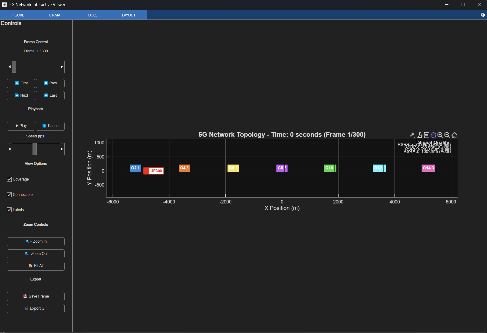
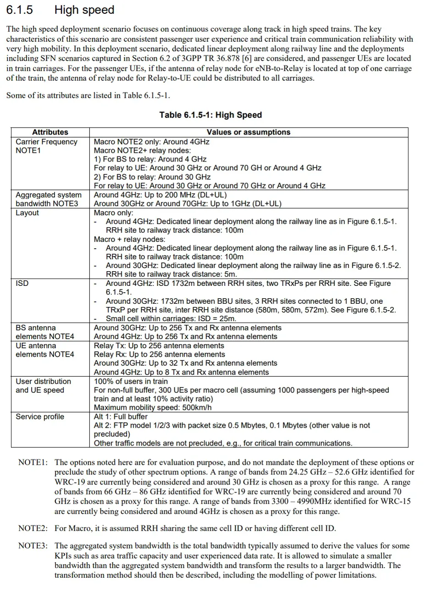

# Kịch bản 5: High Speed (sử dụng cho kịch bản test giai đoạn 2)
Kịch bản này mô phỏng một khu vực có mật độ người dùng cao di chuyển với tốc độ cao, chẳng hạn như khu vực xung quanh các tuyến đường sắt cao tốc hoặc các tuyến đường chính trong thành phố. Mục tiêu của kịch bản này là đánh giá hiệu suất của hệ thống mạng trong việc duy trì kết nối ổn định và cung cấp dịch vụ chất lượng cao cho người dùng di động nhanh.

*Hình 1: Layout trong mô phỏng với 14 ô (cells)*

*Hình 2: Mô tả kịch bản trong 3GPP TR 38.901*

### Mô tả tổng quan
**High Speed** là một kịch bản mô phỏng mạng di động trong môi trường đô thị với mật độ người dùng cao và tốc độ di chuyển nhanh. Kịch bản này được thiết kế để đánh giá hiệu suất của hệ thống mạng trong việc cung cấp dịch vụ chất lượng cao cho người dùng di động nhanh, chẳng hạn như những người sử dụng tàu điện ngầm hoặc xe buýt trong thành phố.

### Thông số kỹ thuật chi tiết

| **Thông số** | **Giá trị** | **Đơn vị** | **Ghi chú** |
|--------------|-------------|------------|-------------|
| **Deployment Scenario** | high_speed | - | Kịch bản 3GPP |
| **Carrier Frequency** | 4.0 | GHz | Mid-band 5G |
| **System Bandwidth** | 200 | MHz | Băng thông rộng |
| **Layout** | linear_railway | - | Tuyến đường sắt tuyến tính |
| **Inter-Site Distance** | 1732 | m | Khoảng cách tiêu chuẩn |
| **Number of Sites** | 7 | site | Triển khai tuyến tính |
| **Sectors per Site** | 2 | sector | Dual sector |
| **Antenna Height** | 35 | m | Độ cao tiêu chuẩn |
| **Cell Radius** | 1000 | m | Coverage rộng |

### Cấu hình năng lượng và công suất

| **Thông số** | **Giá trị** | **Đơn vị** | **Đặc điểm** |
|--------------|-------------|------------|-------------|
| **Min Tx Power** | 20 | dBm | Công suất tối thiểu |
| **Max Tx Power** | 46 | dBm | Công suất tối đa |
| **Base Power** | 1200 | W | Tiêu thụ cơ sở |
| **Idle Power** | 300 | W | Chế độ chờ |

### Đặc điểm người dùng và môi trường

| **Thông số** | **Giá trị** | **Đặc điểm** |
|--------------|-------------|-------------|
| **Number of UEs** | 300 | **Tải cao**: ~43 UE/cell |
| **User Distribution** | 100% of users in train | Hoàn toàn trong tàu |
| **UE Speed** | 500 km/h | Tàu cao tốc |
| **Indoor Ratio** | 100% | Toàn bộ indoor |
| **Train Length** | 200 m | Chiều dài tàu |
| **Track Length** | 10000 m | Chiều dài đường ray |

| **Thông số** | **Giá trị** | **Mục đích** |
|--------------|-------------|-------------|
| **Simulation Time** | 300 | giây |
| **Time Step** | 1 | giây |
| **Traffic Lambda** | 30 | Tải cao |
| **Peak Hour Multiplier** | 1.5 | Hệ số giờ cao điểm |
| **Traffic Lambda** | 20 | Tải trung bình |
| **Peak Hour Multiplier** | 1.5 | Hệ số giờ cao điểm |

| **Metric** | **Threshold** | **Đơn vị** | **Đặc điểm** |
|------------|---------------|------------|-----------|
| **RSRP Serving** | -110 | dBm | Công suất phục vụ tối thiểu |
| **RSRP Target** | -95 | dBm | Công suất phục vụ mục tiêu |
| **RSRP Measurement** | -115 | dBm | Công suất đo lường |
| **Drop Call** | 1 | % | Tỷ lệ rớt cuộc gọi |
| **Latency** | 50 | ms | Độ trễ tối đa |
| **CPU Usage** | 95 | % | mức sử dụng CPU tối đa |
| **PRB Usage** | 95 | % | mức sử dụng PRB tối đa |
| **CPU Usage** | 90 | % | mức sử dụng CPU tối đa |
| **PRB Usage** | 90 | % | mức sử dụng PRB tối đa |

---